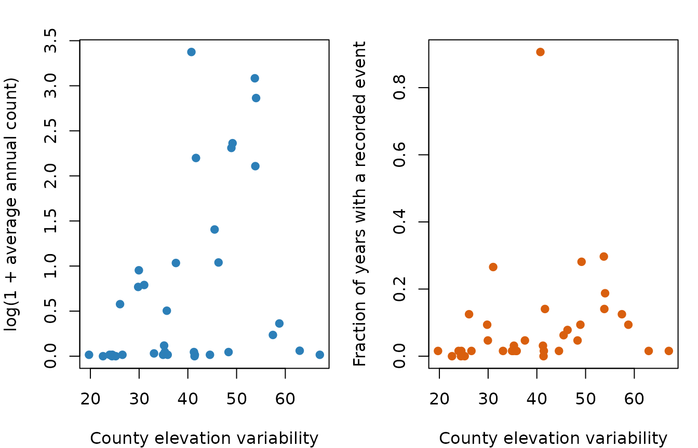
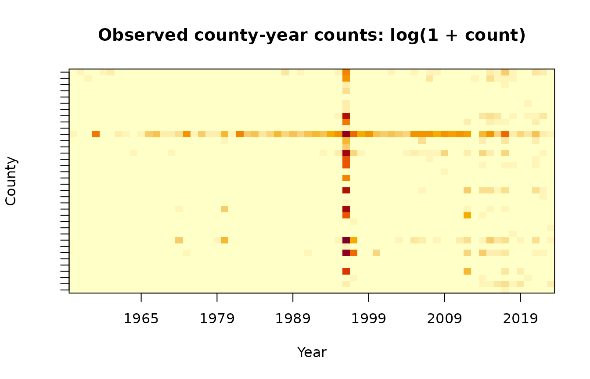
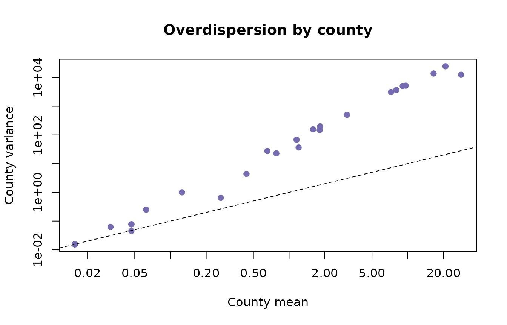
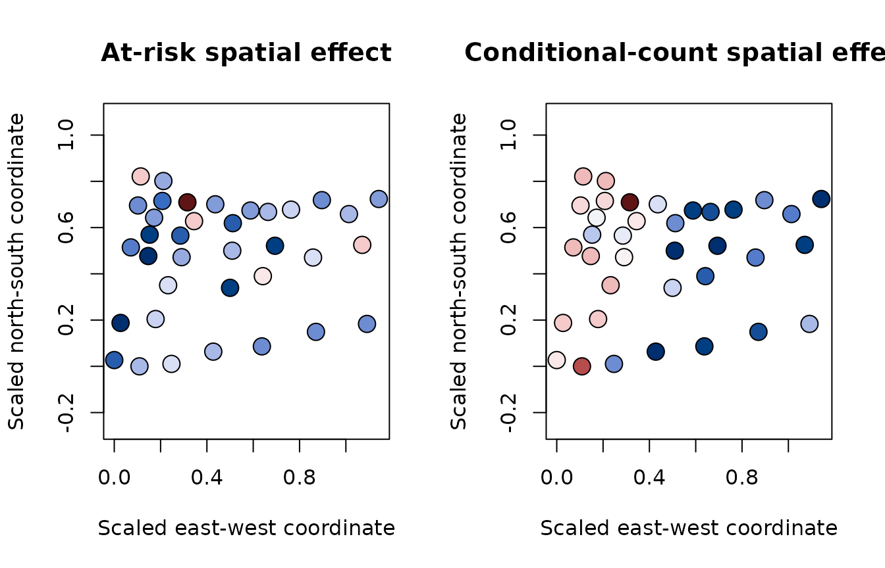
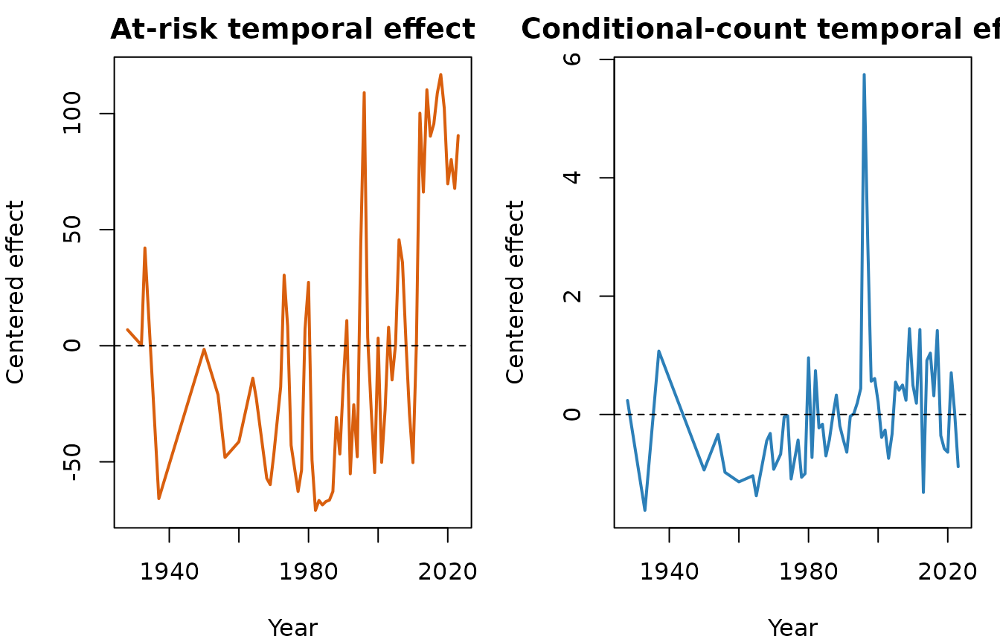

# Oregon Landslides: A Spatiotemporal ZINB-GP Case Study

## Scope of the analysis

This vignette reproduces the main workflow used for the Oregon
application in Scott and Huang, *Imaging-derived spatiotemporal modeling
of landslide counts with noisy Gaussian process random effects*. The
response is the number of recorded landslides in each Oregon county and
calendar year. The fitted panel has 36 counties, 64 observed year
levels, and one observation per county-year.

This is an areal model of recorded occurrence and intensity. It is not a
grid-cell physical-hazard model. Elevation information begins on a
raster but is aggregated to county support before modeling. Assigning a
county total to every raster cell would create pseudo-replication and
would change the scientific question.

The landslide archive is not a designed observation process. A recorded
zero may mean no event or incomplete recording. For that reason, we
interpret the logistic component as the probability that a county-year
is in an at-risk/recordable state. The negative-binomial component
describes the number of recorded events conditional on that state.

## Read and align the panel

The small, analysis-ready files used here are installed with the
package. The rows of the observation matrix are counties and the columns
are years.

``` r

library(ZINB.GP)
#> 
#> Attaching package: 'ZINB.GP'
#> The following object is masked from 'package:stats':
#> 
#>     kernel

data_dir <- system.file("extdata", "oregon", package = "ZINB.GP")
if (data_dir == "") {
  data_dir <- file.path("..", "inst", "extdata", "oregon")
}

observations <- as.matrix(read.table(
  file.path(data_dir, "landslides_county_year.dat")
))
county_data <- read.csv(file.path(data_dir, "counties.csv"))
years <- read.csv(file.path(data_dir, "Years.csv"))[[2]]

dim(observations)
#> [1] 36 64
mean(observations == 0)
#> [1] 0.9084201
```

[`make_y_Vs_Vt()`](https://kingjms1.github.io/GP_ZINB_R/reference/make_y_Vs_Vt.md)
flattens the matrix in column-major order. Its `Vs` and `Vt` rows follow
the same order, and their first columns are removed to define the
baseline county and year.

``` r

panel <- make_y_Vs_Vt(observations)
y <- panel$y
Vs <- panel$Vs
Vt <- panel$Vt

stopifnot(
  length(y) == nrow(Vs),
  nrow(Vs) == nrow(Vt),
  ncol(Vs) == nrow(observations) - 1,
  ncol(Vt) == ncol(observations) - 1
)
```

The raster-derived covariate is an area-weighted county average of local
elevation variability. Because the first county is the baseline, its
covariate value contributes through the fixed-effect design just like
every other county; only the GP indicator column is omitted.

``` r

elevation_sd <- county_data$county_elev_std
X <- cbind(
  "(Intercept)" = 1,
  elevation_sd = as.vector(
    cbind(1, Vs) %*% elevation_sd
  )
)

head(X)
#>      (Intercept) elevation_sd
#> [1,]           1     67.08289
#> [2,]           1    124.53738
#> [3,]           1    115.43480
#> [4,]           1    112.57219
#> [5,]           1     92.27124
#> [6,]           1     89.66906
```

## Describe the data before fitting

The two panels below connect the covariate to the two model components.
Average annual count is related to conditional intensity, while the
fraction of nonzero years is related to the at-risk/recordable process.

``` r

county_mean <- rowMeans(observations)
county_nonzero <- rowMeans(observations > 0)

par(mfrow = c(1, 2), mar = c(4, 4, 2, 1))
plot(
  elevation_sd, log1p(county_mean),
  xlab = "County elevation variability",
  ylab = "log(1 + average annual count)",
  pch = 19, col = "#2C7FB8"
)
plot(
  elevation_sd, county_nonzero,
  xlab = "County elevation variability",
  ylab = "Fraction of years with a recorded event",
  pch = 19, col = "#D95F0E"
)
```



``` r

par(mfrow = c(1, 1))
```

The county-year heatmap exposes three features that motivate the model:
approximately 90% zeros, strong county heterogeneity, and temporal
clusters of large counts.

``` r

image(
  x = seq_along(years),
  y = seq_len(nrow(observations)),
  z = t(log1p(observations)),
  axes = FALSE,
  xlab = "Year",
  ylab = "County",
  main = "Observed county-year counts: log(1 + count)",
  col = hcl.colors(25, "YlOrRd", rev = TRUE)
)
year_ticks <- pretty(seq_along(years))
year_ticks <- year_ticks[year_ticks >= 1 & year_ticks <= length(years)]
axis(1, at = year_ticks, labels = years[year_ticks])
axis(2, at = seq_len(nrow(observations)), labels = FALSE)
box()
```



Overdispersion is also visible without fitting a model. Most counties
lie well above the Poisson reference line, on which the mean equals the
variance.

``` r

county_variance <- apply(observations, 1, var)
plot(
  county_mean, county_variance,
  log = "xy",
  xlab = "County mean",
  ylab = "County variance",
  pch = 19, col = "#756BB1",
  main = "Overdispersion by county"
)
#> Warning in xy.coords(x, y, xlabel, ylabel, log): 4 x values <= 0 omitted from
#> logarithmic plot
#> Warning in xy.coords(x, y, xlabel, ylabel, log): 4 y values <= 0 omitted from
#> logarithmic plot
abline(a = 0, b = 1, lty = 2)
```



## Distance matrices and model fit

The squared-exponential kernel is \\K\_\ell(h,h')=\exp\\-\lVert
h-h'\rVert^2/\ell^2\\\\. The package accepts ordinary pairwise distances
and squares them internally. The county distances below are multiplied
by 100 to use a convenient numerical scale; time is measured in years. A
new location or time must use exactly the same scaling.

``` r

Ds <- 100 * as.matrix(read.table(
  file.path(data_dir, "county_dist_scale.dat")
))
Dt <- as.matrix(read.table(file.path(data_dir, "time_dist.dat")))
county_coords <- as.matrix(read.table(
  file.path(data_dir, "counties_coords.dat")
))

stopifnot(
  nrow(Ds) == ncol(Vs) + 1,
  nrow(Dt) == ncol(Vt) + 1,
  nrow(county_coords) == nrow(Ds)
)
```

The complete model puts spatial and temporal GPs in both components. The
range proposal often needs tuning; a useful production analysis should
use multiple, long chains. This expensive call is not run when CRAN
builds the vignette.

``` r

lt_prior <- list(max = 125, mh_sd = 0.5, a = 1, b = 0.001)
ls_prior <- list(max = 250, mh_sd = 3, a = 1, b = 0.001)

fit <- ZINB_GP(
  X = X,
  y = y,
  coords = county_coords,
  Vs = Vs,
  Vt = Vt,
  Ds = Ds,
  Dt = Dt,
  nsim = 162000,
  burn = 20000,
  thin = 100,
  save_ypred = FALSE,
  print_progress = TRUE,
  use_count_gp = TRUE,
  use_inflation_gp = TRUE,
  ltPrior = lt_prior,
  lsPrior = ls_prior
)
```

For the remaining examples, we use a compact set of posterior draws from
a long run. The archive contains regression, random-effect, covariance,
and dispersion draws needed for the analyses below while keeping the
installed dataset small. Exact values can vary across chains; the
workflow and interpretation are the focus here.

``` r

fit <- readRDS(file.path(data_dir, "posterior_draws.rds"))
names(fit)
#>  [1] "Alpha"   "Beta"    "A"       "B"       "C"       "D"       "L1t"    
#>  [8] "Sigma1t" "Noise1t" "L2t"     "Sigma2t" "Noise2t" "L1s"     "Sigma1s"
#> [15] "Noise1s" "L2s"     "Sigma2s" "Noise2s" "R"
```

## Fixed effects

The interval table keeps the two submodels separate. An elevation
coefficient in `Alpha` changes the probability of being at risk; one in
`Beta` changes expected count conditional on being at risk.

``` r

interval <- function(x) {
  quantile(x, probs = c(0.025, 0.5, 0.975), names = FALSE)
}

fixed_effect_intervals <- rbind(
  "At-risk: intercept" = interval(fit$Alpha[, 1]),
  "At-risk: elevation variability" = interval(fit$Alpha[, 2]),
  "Count: intercept" = interval(fit$Beta[, 1]),
  "Count: elevation variability" = interval(fit$Beta[, 2])
)
colnames(fixed_effect_intervals) <- c("2.5%", "median", "97.5%")
round(fixed_effect_intervals, 3)
#>                                  2.5% median 97.5%
#> At-risk: intercept             -0.196 -0.007 0.189
#> At-risk: elevation variability -0.169  0.014 0.177
#> Count: intercept               -0.263 -0.076 0.129
#> Count: elevation variability   -0.036  0.049 0.134
```

Both elevation intervals include zero in these archived draws. After
residual spatial structure is included, the data do not distinguish a
marginal county-level elevation effect from zero. That is not evidence
that topography is irrelevant to individual landslides; it is a
statement about this aggregated covariate at county support.

## Reconstruct and recenter baseline effects

The sampled GP matrices omit the baseline level. Insert zero in the
first column to reconstruct effects on the fitted baseline scale. For
maps and time-series plots, a centered representation is often easier to
read. Subtracting the mean random effect from every level and adding it
to the intercept preserves every linear predictor.

``` r

recenter_draws <- function(reduced_effect, intercept) {
  full_effect <- cbind(0, reduced_effect)
  shift <- rowMeans(full_effect)
  list(
    effect = sweep(full_effect, 1, shift),
    intercept = intercept + shift
  )
}

at_risk_space <- recenter_draws(fit$A, fit$Alpha[, 1])
count_space <- recenter_draws(fit$C, fit$Beta[, 1])
at_risk_time <- recenter_draws(fit$B, at_risk_space$intercept)
count_time <- recenter_draws(fit$D, count_space$intercept)

# One numerical check: centering preserves the spatial contribution.
j <- 1
s <- 10
baseline_scale <- fit$Alpha[j, 1] + c(0, fit$A[j, ])[s]
centered <- at_risk_space$intercept[j] + at_risk_space$effect[j, s]
stopifnot(isTRUE(all.equal(baseline_scale, centered)))
```

The supplied coordinates are county centroids on the analysis scale. A
centroid display communicates the spatial pattern while keeping the
installed data compact and the example independent of spatial plotting
packages.

``` r

plot_spatial_effect <- function(value, title) {
  palette <- hcl.colors(30, "Blue-Red 3")
  bins <- cut(value, breaks = 30, include.lowest = TRUE)
  plot(
    county_coords[, 1], county_coords[, 2],
    asp = 1, pch = 21, cex = 1.8,
    bg = palette[as.integer(bins)],
    xlab = "Scaled east-west coordinate",
    ylab = "Scaled north-south coordinate",
    main = title
  )
}

par(mfrow = c(1, 2))
plot_spatial_effect(
  colMeans(at_risk_space$effect),
  "At-risk spatial effect"
)
plot_spatial_effect(
  colMeans(count_space$effect),
  "Conditional-count spatial effect"
)
```



``` r

par(mfrow = c(1, 1))
```

The two temporal matrices correspond to different linear predictors: `B`
belongs to the at-risk model and `D` belongs to the conditional count
model. Separate panels preserve that distinction in the interpretation.

``` r

par(mfrow = c(1, 2), mar = c(4, 4, 2, 1))
plot(
  years, colMeans(at_risk_time$effect),
  type = "l", lwd = 2, col = "#D95F0E",
  xlab = "Year", ylab = "Centered effect",
  main = "At-risk temporal effect"
)
abline(h = 0, lty = 2)
plot(
  years, colMeans(count_time$effect),
  type = "l", lwd = 2, col = "#2C7FB8",
  xlab = "Year", ylab = "Centered effect",
  main = "Conditional-count temporal effect"
)
abline(h = 0, lty = 2)
```



``` r

par(mfrow = c(1, 1))
```

The paper identifies 1996 as a pronounced temporal shock. The event
should be checked against the raw annual counts as well as the posterior
effect; a temporal GP can summarize an observed pattern but cannot by
itself establish its physical cause.

## Posterior fitted means

For posterior draw \\m\\, the fitted marginal mean is

\\ \operatorname{E}(Y_j\mid\theta^{(m)}) =
\operatorname{logit}^{-1}(\eta\_{1j}^{(m)}) \times
r^{(m)}\exp(\eta\_{2j}^{(m)}). \\

The following calculation uses every tenth archived draw and compares
observed and fitted annual totals. It is a fitted-data check, not
out-of-sample validation.

``` r

draw_id <- seq(1, nrow(fit$Alpha), by = 10)

eta1 <- fit$Alpha[draw_id, , drop = FALSE] %*% t(X) +
  fit$A[draw_id, , drop = FALSE] %*% t(Vs) +
  fit$B[draw_id, , drop = FALSE] %*% t(Vt)
eta2 <- fit$Beta[draw_id, , drop = FALSE] %*% t(X) +
  fit$C[draw_id, , drop = FALSE] %*% t(Vs) +
  fit$D[draw_id, , drop = FALSE] %*% t(Vt)

fitted_mean <- plogis(eta1) * exp(eta2)
fitted_mean <- sweep(fitted_mean, 1, fit$R[draw_id], "*")
posterior_mean <- colMeans(fitted_mean)

observed_by_year <- colSums(observations)
fitted_by_year <- colSums(matrix(
  posterior_mean,
  nrow = nrow(observations)
))

plot(
  years, log1p(observed_by_year),
  type = "l", lwd = 2, col = "black",
  xlab = "Year", ylab = "log(1 + annual total)",
  main = "Observed and posterior fitted annual totals"
)
lines(years, log1p(fitted_by_year), lwd = 2, col = "#2C7FB8")
legend(
  "topleft",
  legend = c("Observed", "Posterior fitted mean"),
  col = c("black", "#2C7FB8"), lwd = 2, bty = "n"
)
```


Large disagreements can indicate lack of fit, insufficient mixing, or
both. A stronger analysis would also inspect zero fractions, upper-tail
counts, and held-out county-years.

## MCMC wrappers and effective sample size

Package output is intentionally a list of ordinary vectors and matrices,
which makes it easy to use established diagnostics. With `coda`, bind
scalar parameters into one matrix and wrap it as an `mcmc` object:

``` r

scalar_draws <- cbind(
  alpha_intercept = fit$Alpha[, 1],
  alpha_elevation = fit$Alpha[, 2],
  beta_intercept = fit$Beta[, 1],
  beta_elevation = fit$Beta[, 2],
  range_time_at_risk = fit$L1t,
  range_time_count = fit$L2t,
  range_space_at_risk = fit$L1s,
  range_space_count = fit$L2s,
  dispersion = fit$R
)

chain <- coda::mcmc(scalar_draws)
round(coda::effectiveSize(chain), 1)
#>     alpha_intercept     alpha_elevation      beta_intercept      beta_elevation 
#>              1000.0               894.4               884.9              1000.0 
#>  range_time_at_risk    range_time_count range_space_at_risk   range_space_count 
#>               105.8               251.2               179.7               497.6 
#>          dispersion 
#>               102.1
```

ESS estimates the number of independent draws represented by an
autocorrelated chain. A nominal sample size of 1,000 can therefore
contain far less information for a slowly mixing range parameter. Trace
and autocorrelation plots help locate the problem:

``` r

par(mfrow = c(1, 2))
coda::traceplot(chain[, "range_space_count"], main = "Trace: count spatial range")
coda::autocorr.plot(
  chain[, "range_space_count"],
  auto.layout = FALSE,
  main = "Autocorrelation"
)
```


``` r

par(mfrow = c(1, 1))
```

For independent chains, create one `mcmc` object per fit and combine
them. This enables between-chain diagnostics such as split-chain
comparisons and Gelman-Rubin statistics.

``` r

extract_scalars <- function(x) {
  cbind(
    alpha_intercept = x$Alpha[, 1],
    alpha_elevation = x$Alpha[, 2],
    beta_intercept = x$Beta[, 1],
    beta_elevation = x$Beta[, 2],
    range_time_at_risk = x$L1t,
    range_time_count = x$L2t,
    range_space_at_risk = x$L1s,
    range_space_count = x$L2s,
    dispersion = x$R
  )
}

# fits must come from independent runs with different random-number seeds.
chains <- coda::mcmc.list(lapply(fits, function(x) {
  coda::mcmc(extract_scalars(x))
}))
coda::gelman.diag(chains, multivariate = FALSE)
coda::effectiveSize(chains)
```

The `posterior` package is another convenient wrapper. It provides bulk
and tail ESS using conventions shared by modern Bayesian software:

``` r

draws <- posterior::as_draws_matrix(scalar_draws)
posterior::summarise_draws(
  draws,
  posterior::mean,
  posterior::sd,
  posterior::ess_bulk,
  posterior::ess_tail
)
```

With only one chain, \\\widehat R\\ cannot assess between-chain
convergence. For release-quality scientific work, use several
independent chains, examine bulk and tail ESS, inspect trace plots, and
extend or retune chains when range parameters mix slowly. Thinning
reduces storage and plotting cost; it does not repair poor mixing or
create information.
